# Architecture Quick — слои и контракты

## Поток данных (главный конвейер)

```mermaid
flowchart LR
    CAM["📹 video-capture<br/>(V4L2 v4l / V4L2-direct / Synthetic / Replay)"]
    INF["🧠 cv-inference<br/>(RKNN bridge / ONNX / Mock)"]
    TRK["🎯 target-tracker<br/>(KalmanFilter2D + Hungarian)"]
    CMD["⚙️ commander<br/>(FSM + anti-loop + PID)"]
    FC["🚁 fc-adapter<br/>(MAVLink → ArduPilot)"]

    CAM -- "Frame (RGB24/NV12)" --> INF
    INF -- "Vec<Detection>" --> TRK
    TRK -- "TargetState (bbox, velocity)" --> CMD
    CMD -- "RoiTarget / PositionTargetNED<br/>(rate-limited 10 Hz)" --> FC
    FC -- "MAVLink v2" --> ArduPilot
    ArduPilot -. "Telemetry: attitude, GPS, heartbeat" .-> FC
```



**Commander — единственный с правом отправлять команды FC.**

## Крейты (10 + C++)

| Крейт | Ответственность |
|---|---|
| `common` | доменные типы, ошибки, TOML-конфиг, сценарии |
| `video-capture` | `VideoSource` trait + 4 реализации (Synthetic/Replay/V4l2 `v4l`/V4l2Direct `v4l2-direct`) + конвертация пикселей |
| `yolov8` | letterbox + postprocess (чистая логика, без ONNX/RKNN) |
| `cv-inference` | `InferenceBackend` trait + Mock + ONNX (cpu-onnx) + RknnBridgeClient (unix) |
| `cv-visualizer` | headless bbox/labels → JPEG + JSONL |
| `system-telemetry` | RSS, CPU/NPU temp, NPU load, MetricsRecorder (FPS/latency p50/p95) |
| `target-tracker` | KalmanFilter2D + TargetTracker + MultiTargetTracker (Hungarian) |
| `fc-adapter` | `FlightControllerAdapter` trait + Mock/SITL/ArduPilot + CommandRateLimiter |
| `commander` | StateMachine (9 состояний) + 5 watchdogs + AntiLoopGuard + PID + SafetyMonitor |
| `cli` | бинарь `auto-targeting`: REPL + scenario runner + health-check |
| `rknn-bridge` (C++) | NPU-инференс микросервис, zero-copy IO, Unix-socket IPC |

## Три trait-контракта (это API для разработчика)

### 1. `VideoSource` (`video-capture`)
```rust
async fn start(&mut self) -> Result<Receiver<Frame>>
async fn stop(&mut self) -> Result<()>
fn name(&self) -> &str
```

### 2. `InferenceBackend` (`cv-inference`)
```rust
async fn init(&mut self) -> Result<()>
async fn infer(&mut self, &Frame) -> Result<Vec<Detection>>
async fn health_check(&self) -> Result<()>
fn name(&self) -> &str
```

### 3. `FlightControllerAdapter` (`fc-adapter`)
```rust
async fn set_roi(RoiTarget) -> Result<()>
async fn set_position_target_local_ned(PositionTargetNED) -> Result<()>
async fn set_mode(FlightMode) -> Result<()>
async fn arm() / disarm() -> Result<()>
fn attitude() -> Attitude
fn heartbeat_status() -> HeartbeatStatus
async fn connect() / disconnect() -> Result<()>
```

## Safety: 7 слоёв anti-loop

1. 5 watchdog timers (video/inference/tracking/command/FC heartbeat)
2. Deterministic state machine (запрещённые переходы отклоняются)
3. Deadband + hysteresis (мелкие колебания игнорируются)
4. Rate limiter 10 Hz (drop excess, не queue)
5. Oscillation detector (3 триггера/5сек → ABORT + RTH)
6. Safety pilot RC override (ArduPilot config)
7. systemd WatchdogSec=10 (kill + restart)

## IPC C++↔Rust

Unix domain socket + length-prefixed JSON (canonical big-endian). 4 пары сообщений: `init/infer/health/shutdown` (+ `_ack`). Кадр — inline как base64 (zero-copy SHM — TODO Phase 6).

## Захват камеры: два backend'а

| Backend | Feature | Реализация | Throughput |
|---|---|---|---|
| `V4l2Source` | `v4l2` | через `v4l` crate (MMAP stream) | ~21 FPS (узкое место) |
| `V4l2DirectSource` | `v4l2-direct` | прямой `libc` ioctl (VIDIOC_DQBUF/QBUF), сырые `[u8;88]` буферы | **32 FPS** (рекомендуемый) |

Capture policy — **drop-new** (`try_send`): при full-канале дропается новый кадр,
capture-поток никогда не блокируется (D-010). Для realtime-видео это даёт
consumer'у свежий кадр, как только он готов.
