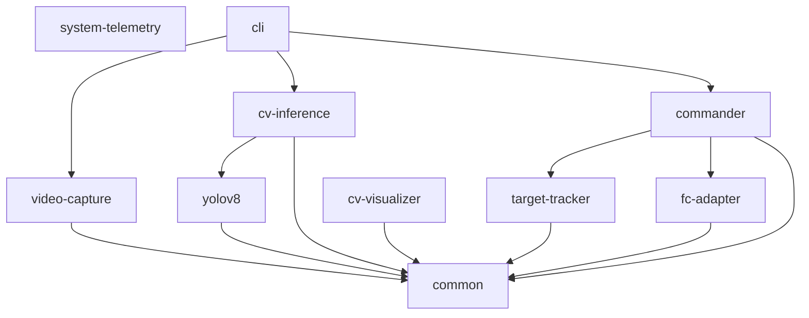

# SDD-SPEC — Auto-Targeting System

> **Spec-Driven Development спецификация.** Этот документ — единственный
> источник истины для всей последующей разработки. Написан так, чтобы агент
> или разработчик, впервые видящий проект, мог реализовать фичи, чинить баги
> и рефакторить **без чтения исходного кода**. Каждое утверждение
> сопровождается ссылкой `файл:строка` для проверки.
>
> **Живой документ:** обновляется синхронно с кодом (см. §14 «Как использовать»).
> **Сопровождающие файлы:** `docs/sdd/progress.json` (трекинг этапов),
> `docs/sdd/decisions.md` (журнал решений).

**Версия спеки:** 1.0 · **Дата:** 2026-08-05 · **Ветка:** `feature/phase-1.1-cv-loop`

---

## Содержание

1. [Введение и глоссарий](#1-введение-и-глоссарий)
2. [Архитектурный обзор](#2-архитектурный-обзор)
3. [Структура кодовой базы](#3-структура-кодовой-базы)
4. [Модели данных и их отношения](#4-модели-данных-и-их-отношения)
5. [Trait-контракты (API)](#5-trait-контракты-api)
6. [IPC-протокол C++↔Rust](#6-ipc-протокол-crust)
7. [Конфигурация](#7-конфигурация)
8. [Бизнес-логика: потоки, сценарии, anti-loop](#8-бизнес-логика-потоки-сценарии-anti-loop)
9. [Критические алгоритмы и оптимизации](#9-критические-алгоритмы-и-оптимизации)
10. [Стратегия тестирования](#10-стратегия-тестирования)
11. [Развёртывание и окружение](#11-развёртывание-и-окружение)
12. [Anti-loop политика для будущих агентов](#12-anti-loop-политика-для-будущих-агентов)
13. [Рекомендации по MCP-серверам](#13-рекомендации-по-mcp-серверам)
14. [Как использовать эту спецификацию (SDD-workflow)](#14-как-использовать-эту-спецификацию-sdd-workflow)
15. [Известные расхождения и TODO](#15-известные-расхождения-и-todo)

---

## 1. Введение и глоссарий

### 1.1 Что это

**Auto-Targeting System** — бортовая система компьютерного зрения для коптера:
получает кадры с камеры → обнаруживает объекты → сопровождает выбранную цель →
управляет автопилотом для её удержания в кадре. Целевая платформа —
**RK3588/RK3588S** (Orange Pi 5 и аналоги) с NPU.

**Текущая фаза зрелости:** Phase 0–6 завершены «в софте» (mock/synthetic/SITL);
Phase 1.1 (минимальный контур CV) реализован; HITL/Flight tests — ожидают
железо. См. [ROADMAP.md](ROADMAP.md) для полного плана фаз.

### 1.2 Что НЕ входит (явные границы)

- **CAN-шина** — не используется на текущем этапе.
- **Финальная обученная модель** — baseline COCO YOLOv8n; классы стенда
  (палатка/ящик/джип) — задача Phase 1.2.
- **PWM напрямую с Orange Pi** — запрещено (см. SAFETY.md правило 3).
- **Автоматическое сопровождение движущихся целей** — трекер есть, но
  MVP работает со статикой.

### 1.3 Глоссарий

| Термин | Значение |
|---|---|
| **RK3588 / RK3588S** | SoC от Rockchip с 6-ядерным CPU + NPU (6 TOPS). Целевой борт. |
| **NPU** | Neural Processing Unit — аппаратный ускоритель инференса на RK3588. |
| **RKNN** | формат модели + SDK (`librknnrt.so`) для инференса на NPU. |
| **MAVLink** | протокол связи с автопилотом (v2). |
| **ArduPilot** | open-source автопилот; целевой FC (SpeedyBee F405). |
| **FC** | Flight Controller — полётный контроллер. |
| **БВК** | Бортовой вычислительный комплекс (= Orange Pi 5). |
| **SITL** | Software-In-The-Loop — симуляция автопилота в Docker. |
| **HITL** | Hardware-In-The-Loop — реальный FC + софт-камера. |
| **FOV** | Field of View — угол обзора камеры. |
| **NED** | North-East-Down — система координат автопилота. |
| **ROI** | Region of Interest — куда направить камеру/гимбал. |
| **RTH** | Return-To-Home — возврат домой (режим ArduPilot). |
| **V4L2** | Video4Linux2 — API захвата кадров. |
| **NV12 / YUYV / MJPEG** | пиксельные форматы (YUV 4:2:0 semi-planar / YUV 4:2:2 packed / JPEG). |
| **dmabuf / SCM_RIGHTS** | механизмы zero-copy передачи кадра (план Phase 6). |
| **Anti-loop** | защита от осцилляций автопилота (см. §8.3). |
| **Watchdog** | таймер контроля живости цикла (захват/инференс/трекинг/команда/FC heartbeat). |

---

## 2. Архитектурный обзор

### 2.1 Парадигма

**Слоистая HAL-архитектура** (Hardware Abstraction Layer) на Rust, с одним
**C++ микросервисом** (`rknn-bridge`) для NPU-инференса. Каждый слой
изолирован trait-границей, что даёт:

- тестируемость (mock-реализации каждого слоя);
- детерминированность (SITL/scenario-runs без железа);
- переносимость (CPU fallback через ONNX, NPU через RKNN).

### 2.2 Поток данных (главный конвейер)

```mermaid
flowchart LR
    CAM["📹 video-capture<br/>(V4L2 / Synthetic / Replay)"]
    INF["🧠 cv-inference<br/>(RKNN bridge / ONNX / Mock)"]
    TRK["🎯 target-tracker<br/>(KalmanFilter2D + Hungarian)"]
    CMD["⚙️ commander<br/>(FSM + anti-loop + PID)"]
    FC["🚁 fc-adapter<br/>(MAVLink → ArduPilot)"]

    CAM -- "Frame (NV12/RGB, shared mem)" --> INF
    INF -- "Vec&lt;Detection&gt;" --> TRK
    TRK -- "TargetState (bbox, velocity)" --> CMD
    CMD -- "RoiTarget / PositionTargetNED<br/>(rate-limited 10 Hz)" --> FC
    FC -- "MAVLink v2 (UART/UDP)" --> ArduPilot
    ArduPilot -. "Telemetry: attitude, GPS, heartbeat" .-> FC
```



**Единственный модуль с правом отправлять команды FC** — `commander`
(`crates/commander/src/lib.rs:5`: «single component with authority to issue
MAVLink commands»). Все остальные слои только производят данные.

### 2.3 Почему C++-bridge для NPU (ADR-0001)

Pure-Rust bindings к RKNPU2 SDK недостаточно зрелые (HYPOTHESES.md H-001,
CRITICAL). Поэтому инференс выделен в отдельный C++ микросервис, общающийся
с Rust-оркестратором через Unix domain socket + JSON (см. §6). Это принято в
[ADR-0001](ADR/0001-rknn-cpp-bridge.md).

### 2.4 Принципы безопасности (SAFETY.md)

- **Fail-safe by default:** потеря любого потока (video/detections/FC
  heartbeat) → STOP команд. «Better to lose the target than crash the drone».
- **`panic = "abort"`** в release-профиле (`Cargo.toml:90`) — для
  safety-critical embedded.
- **Никогда не обходить state machine**, кроме `force_transition()` для ABORT.
- **7 слоёв anti-loop** (см. §8.3).

---

## 3. Структура кодовой базы

Workspace `auto-targeting/` — 10 Rust-крейтов + C++ `rknn-bridge/`.

| Crate / модуль | Ответственность | Ключевой файл |
|---|---|---|
| **common** | Доменные типы, ошибки, TOML-конфиг, парсер сценариев. Framework-agnostic. | `crates/common/src/lib.rs:37-51` |
| **video-capture** | Источники кадров: `SyntheticVideoSource`, `ReplaySource`, `V4l2Source` (feature `v4l2`). Конвертация пикселей. | `crates/video-capture/src/lib.rs:18-39` |
| **yolov8** | Чистый Rust, backend-агностичный. `letterbox` + `postprocess` для YOLOv8 `[1,4+nc,anchors]`. `#![deny(unsafe_code)]`. | `crates/yolov8/src/lib.rs:42,217,318` |
| **cv-inference** | Trait `InferenceBackend`. `RknnBridgeClient` (Unix-only), NMS, `CpuInferenceBackend` (feature `cpu-onnx`). | `crates/cv-inference/src/lib.rs:18-44` |
| **cv-visualizer** | Headless-аннотатор: bbox/labels на RGB24 → JPEG + JSONL. Чистый Rust (`image`+`imageproc`+`ab_glyph`). | `crates/cv-visualizer/src/lib.rs:36` |
| **system-telemetry** | Зонды Linux sysfs: RSS, CPU/NPU temp, NPU load. `MetricsRecorder` (FPS/latency p50/p95). | `crates/system-telemetry/src/lib.rs:26` |
| **target-tracker** | `KalmanFilter2D`, `TargetTracker` (один), `MultiTargetTracker` (Hungarian). | `crates/target-tracker/src/lib.rs:16-23` |
| **fc-adapter** | HAL: trait `FlightControllerAdapter` + Mock/SITL/ArduPilot, `CommandRateLimiter`. | `crates/fc-adapter/src/lib.rs:10-40` |
| **commander** | FSM (9 состояний) + 5 watchdogs + anti-loop guard + PID + safety (geofence/battery). | `crates/commander/src/lib.rs:8-31` |
| **cli** | Бинарь `auto-targeting`. Режимы: Full/MockFc/MockAll/Repl/Scenario/HealthCheck. | `crates/cli/src/main.rs:42-56` |
| **rknn-bridge (C++)** | Микросервис NPU-инференса. `HAVE_RKNN=0` → StubBackend, `=1` → RknnBackend (`librknnrt.so`). | `rknn-bridge/CMakeLists.txt:26-46` |

### 3.1 Зависимости между крейтами



`common` — фундамент, без циклических зависимостей. `commander` — единственный,
кто зависит и от `target-tracker`, и от `fc-adapter` (он сводит данные к командам).

---

## 4. Модели данных и их отношения

Источник: `crates/common/src/types.rs`. Все типы `#[derive(Serialize, Deserialize)]`
для JSON/IPC, если не указано иное.

### 4.1 ER-диаграмма

```mermaid
erDiagram
    Frame ||--|| FrameMetadata : has
    FrameMetadata ||--|| PixelFormat : "format"
    Detection ||--|| BoundingBox : bbox
    TargetState ||--|| BoundingBox : bbox
    TargetState ||--|| TargetId : id
    HeartbeatStatus ||--|| FlightMode : mode
    PositionTargetNED }|..|| RoiTarget : "альтернатива команды"

    Frame {
        Vec~u8~ data
        FrameMetadata metadata
    }
    Detection {
        BoundingBox bbox
        String class
        u32 class_id
        f32 confidence
        u64 frame_seq
        DateTime detected_at
    }
    TargetState {
        TargetId id
        BoundingBox bbox
        (f32,f32) velocity
        f32 confidence
        DateTime last_seen
        u32 missed_frames
    }
```

### 4.2 Доменные типы

#### `Timestamp` (`types.rs:12-39`)
```rust
pub struct Timestamp { inner: Instant }  // поле приватное
```
- **Инвариант:** monotonic (процесс-монотонный `Instant`). Нельзя сравнивать
  между процессами — поле `inner` приватное.
- Методы: `now()`, `elapsed_us() -> u64`, `elapsed_ms() -> u64`.
- `Default::default()` = `now()`.

#### `Frame` (`types.rs:47-51`)
```rust
pub struct Frame { pub data: Vec<u8>, pub metadata: FrameMetadata }
```
Владеет данными (Vec). План Phase 6 — shared memory (dmabuf).

#### `FrameMetadata` (`types.rs:54-63`)
| Поле | Тип | Назначение |
|---|---|---|
| `width, height` | `u32` | размер кадра |
| `format` | `PixelFormat` | Nv12/Yuyv/Rgb24/Mjpeg |
| `captured_at` | `DateTime<Utc>` | момент захвата из V4L2 |
| `seq` | `u64` | инкремент на каждый захват, для обнаружения пропусков |

#### `BoundingBox` (`types.rs:81-116`) — КРИТИЧНО
```rust
pub struct BoundingBox { pub x: u32, pub y: u32, pub width: u32, pub height: u32 }
```
**Инвариант:** координаты в пикселях, начало — левый верхний угол, `width/height > 0`.
- `center(&self) -> (f32, f32)` (`:91-96`): `(x + w/2, y + h/2)`.
- `iou(&self, other) -> f32` (`:99-115`): Intersection-over-Union; возвращает
  `0.0` при отсутствии пересечения или `union <= 0.0`.

#### `Detection` (`types.rs:119-132`)
| Поле | Тип | Инвариант |
|---|---|---|
| `bbox` | `BoundingBox` | — |
| `class` | `String` | free-form (например "person") |
| `class_id` | `u32` | зависит от модели (0..nc-1) |
| `confidence` | `f32` | ∈ [0.0, 1.0] |
| `frame_seq` | `u64` | — |
| `detected_at` | `DateTime<Utc>` | wall-clock |

#### `TargetId` (`types.rs:135`)
`pub type TargetId = u64;` — стабилен во время трекинга.

#### `TargetState` (`types.rs:139-161`)
| Поле | Тип | Назначение |
|---|---|---|
| `id` | `TargetId` | — |
| `bbox` | `BoundingBox` | текущая оценка положения |
| `velocity` | `(f32, f32)` | px/s (vx, vy) из Kalman |
| `confidence` | `f32` | последняя детекция |
| `last_seen` | `DateTime<Utc>` | — |
| `missed_frames` | `u32` | подряд без детекции |

Метод `is_lost(max_age_ms: u64) -> bool` (`:155-160`):
`(Utc::now() - last_seen).num_milliseconds() > max_age_ms` (с `.max(0)` защитой).

#### `RoiTarget` (`types.rs:166-174`) — enum
- `GlobalLatLng { lat: f64, lon: f64, alt: f32 }` — по GPS.
- `LocalNed { north, east, down: f32 }` — локальное смещение.
- `None` — clear ROI (дефолтная ориентация).
Отправляется через `MAV_CMD_DO_SET_ROI`.

#### `PositionTargetNED` (`types.rs:179-186`)
```rust
pub struct PositionTargetNED {
    pub north: f32, pub east: f32, pub down: f32, pub yaw: f32
}
```
`yaw` в радианах (0 = North, + = по часовой). Отправляется через
`SET_POSITION_TARGET_LOCAL_NED` на 10 Гц. `#[derive(Default)]`.

#### `HeartbeatStatus` (`types.rs:210-225`) — КРИТИЧНО
```rust
pub struct HeartbeatStatus {
    pub last_heartbeat: DateTime<Utc>,
    pub armed: bool,
    pub mode: FlightMode,
}
```
**Инвариант `is_stale(timeout_ms: u64) -> bool`** (`:219-224`):
```rust
let age = (Utc::now() - last_heartbeat).num_milliseconds().max(0) as u64;
age > timeout_ms
```
`.max(0)` защищает от отрицательного age при рассинхроне часов.

#### `SystemState` (`types.rs:250-284`) — КРИТИЧНО
9 вариантов, `#[default] Idle`:
`Idle, Armed, Scanning, TargetSelected, Tracking, TrackingDegraded, Lost, Rth, Abort`.

`as_str()` возвращает CANON_CASE строки (`"IDLE"`, `"TRACKING_DEGRADED"`, ...).
Таблица переходов — см. §8.1.

#### `FlightMode` (`types.rs:228-245`)
Enum: `Unknown` (default), `Manual, Stabilize, AltHold, Loiter, Guided, Rtl, Auto`.

---

## 5. Trait-контракты (API)

Это **интерфейсы**, через которые слои общаются. Сигнатуры — дословно из кода.

### 5.1 `VideoSource` (`crates/video-capture/src/traits.rs:41-52`)

```rust
#[async_trait]
pub trait VideoSource: Send {
    async fn start(&mut self) -> VideoResult<mpsc::Receiver<Frame>>;
    async fn stop(&mut self) -> VideoResult<>;
    fn name(&self) -> &str;
}
```
Контракт: источник владеет задачей захвата; drop ресивера останавливает захват;
`stop` идемпотентен. `frame_channel(buffer)` хелпер (`:55-57`) = `mpsc::channel`.

**`VideoCaptureError`** (`traits.rs:17-33`): `DeviceOpen(String)`,
`DeviceConfig(String)`, `Capture(String)`, `Decode(String)`, `Disconnected`.

**Реализации:** `SyntheticVideoSource` (готов, тесты), `ReplaySource` (готов),
`V4l2Source` (feature `v4l2`, требует libclang).

### 5.2 `InferenceBackend` (`crates/cv-inference/src/backend.rs:33-46`)

```rust
#[async_trait]
pub trait InferenceBackend: Send {
    async fn init(&mut self) -> InferenceResult<()>;
    async fn infer(&mut self, frame: &Frame) -> InferenceResult<Vec<Detection>>;
    async fn health_check(&self) -> InferenceResult<()>;
    fn name(&self) -> &str;
}
```

**`InferenceError`** (`backend.rs:12-28`): `BridgeConnection(String)`,
`BridgeProtocol(String)`, `Inference(String)`, `ModelNotLoaded`,
`Unavailable(String)`.

**Реализации:**
- `MockInferenceBackend` (`backend.rs:131-164`) — canned детекции; для тестов.
- `CpuInferenceBackend` — feature `cpu-onnx`: реальный ONNX Runtime (`ort`
  2.0-rc.13). Без фичи — stub (`backend.rs:93-128`). См. `cpu_onnx.rs`.
- `RknnBridgeClient` (`bridge_client.rs`, `#[cfg(unix)]`) — реальный клиент к
  C++-bridge. Без Unix — stub в `backend.rs:49-90`.

### 5.3 `FlightControllerAdapter` (`crates/fc-adapter/src/traits.rs:46-93`)

```rust
#[async_trait]
pub trait FlightControllerAdapter: Send {
    async fn set_roi(&mut self, roi: RoiTarget) -> FcResult<()>;
    async fn set_position_target_local_ned(&mut self, target: PositionTargetNED) -> FcResult<()>;
    async fn set_mode(&mut self, mode: FlightMode) -> FcResult<()>;
    async fn arm(&mut self) -> FcResult<()>;
    async fn disarm(&mut self) -> FcResult<()>;
    fn attitude(&self) -> Attitude;
    fn global_position(&self) -> Option<GlobalPosition>;
    fn heartbeat_status(&self) -> HeartbeatStatus;
    fn is_heartbeat_stale(&self, timeout_ms: u64) -> bool { /* default */ }
    async fn connect(&mut self) -> FcResult<()>;
    async fn disconnect(&mut self) -> FcResult<()>;
    fn name(&self) -> &'static str;
}
```
Контракт (`traits.rs:43-45`): **все async-методы cancellation-safe**. Отмена в
середине команды не должна оставлять FC в неконсистентном состоянии.

**`FcError`** (`traits.rs:13-35`): `Connection(String)`,
`CommandRejected(String)`, `HeartbeatLost { last_seen_ms: u64 }`, `Timeout`,
`NotArmed`, `UnsupportedMode(FlightMode)`, `Internal(String)`.

**Реализации:** `MockFcAdapter`, `SittlMavlinkAdapter` (готов, 9 тестов),
`ArduPilotMavlinkAdapter` (stub). Фабрика `build_adapter(&FcConfig)`.

---

## 6. IPC-протокол C++↔Rust

Микросервис `rknn-bridge` (C++) выполняет NPU-инференс; Rust-оркестратор
(`cv-inference::RknnBridgeClient`) вызывает его через Unix-сокет.

### 6.1 Структуры (`rknn-bridge/include/protocol.h`)

| Структура | Поля |
|---|---|
| `BoundingBox` (`:16-21`) | `uint32_t x, y, width, height` |
| `Detection` (`:24-31`) | `bbox; string class_name; uint32_t class_id; float confidence; uint64_t frame_seq, detected_at_ms` |
| `InitRequest` (`:34-41`) | `string model_path; uint32_t input_width, input_height; string input_format; float confidence_threshold, nms_threshold` |
| `InitResponse` (`:43-48`) | `bool ok; string error; uint32_t output_classes; string backend` |
| `InferRequest` (`:52-57`) | `uint64_t frame_seq; int shm_fd; size_t shm_size; uint64_t captured_at_ms` |
| `InferResponse` (`:59-65`) | `bool ok; string error; uint64_t frame_seq; uint32_t latency_ms; vector<Detection> detections` |
| `HealthResponse` (`:68-73`) | `bool ok; bool model_loaded; float npu_utilization; string backend` |
| `MessageType` (`:76-85`) | enum: `INIT=1, INIT_ACK=2, INFER=3, INFER_ACK=4, HEALTH=5, HEALTH_ACK=6, SHUTDOWN=7, SHUTDOWN_ACK=8` |

### 6.2 Транспорт и фрейминг

**Транспорт:** Unix domain socket (AF_UNIX, SOCK_STREAM). Path по умолчанию
`/tmp/rknn-bridge.sock` (config `bridge_socket`, `shm_server.cpp:21-47`).

**Фрейминг — length-prefixed JSON:**

```
[ 4 байта: длина JSON (uint32, CANONICAL BIG-ENDIAN) ][ N байт: JSON-сообщение ]
```

> **Канон = big-endian / network byte order.** Rust пишет `len.to_be_bytes()`
> (`bridge_client.rs:274,285,458,469`). C++ — через `htonl`/`ntohl`
> (`shm_server.cpp:5,87-92,132-133`, фикс D-002). Ранее C++ использовал
> native uint32 (little-endian на x86/aarch64) — это был critical-баг
> interoperability (см. §15).

### 6.3 JSON envelope

Каждое сообщение имеет поле `"type":"..."`. Пример `init_ack`:
```json
{"type":"init_ack","ok":true,"output_classes":80,"backend":"stub"}
```
Пример `infer_ack` (массив детекций):
```json
{"type":"infer_ack","ok":true,"frame_seq":42,"latency_ms":58,"detections":[
  {"bbox":{"x":100,"y":100,"width":50,"height":80},"class":"person","class_id":0,"confidence":0.92}
]}
```

**Сериализация:** C++ — hand-rolled (`bridge_main.cpp:36-167`, TODO: заменить
на nlohmann/json). Rust — `serde_json` (`bridge_client.rs:84-185`).

### 6.4 Протокол обмена (главный цикл `bridge_main.cpp:191-270`)

1. Rust → `init` (InitRequest) → C++ `load_model()` → Rust ← `init_ack`.
2. На каждый кадр: Rust → `infer` (InferRequest) → C++ `infer()` → Rust ←
   `infer_ack` (с `latency_ms`, измеренным `chrono::high_resolution_clock`).
3. Периодически: `health` → `health_ack`.
4. Завершение: `shutdown` → `shutdown_ack` → `break`.

Сигналы SIGINT/SIGTERM → `g_should_stop=true` (`bridge_main.cpp:25-30,173-174`),
цикл выходит чисто, `server.stop()` делает `unlink(socket_path)`
(`shm_server.cpp:63-67`).

### 6.5 Frame data — текущее состояние

Frame передаётся **inline как base64** в поле `frame_data_b64`
(`bridge_client.rs:113-118,395`; hand-rolled base64 без зависимостей,
`:303-330`). `shm_fd` в C++ захардкожен `-1` (`bridge_main.cpp:154`),
`receive_frame()` — stub (`shm_server.cpp:99-113`).

**Production (Phase 6):** memfd + SCM_RIGHTS для zero-copy (TODO, см. §15).

---

## 7. Конфигурация

### 7.1 `config.example.toml` — полный шаблон

| Секция | Поле | Тип | Default |
|---|---|---|---|
| `[video]` | `device` | string | `"/dev/video0"` |
| | `width, height` | u32 | `1280, 720` |
| | `fps` | u32 | `30` |
| | `format` | string | `"mjpeg"` (`"nv12"\|"yuyv"\|"mjpeg"`) |
| | `queue_depth` | usize | `3` |
| `[inference]` | `model_path` | string | `"/opt/auto-targeting/models/yolov8n_int8.rknn"` |
| | `confidence_threshold` | f32 | `0.45` |
| | `nms_threshold` | f32 | `0.45` |
| | `track_classes` | `[string]` | `["person"]` |
| | `bridge_socket` | string | `"/tmp/rknn-bridge.sock"` |
| | `allow_cpu_fallback` | bool | `false` |
| `[tracker]` | `max_target_age_ms` | u64 | `2000` |
| | `max_missed_frames` | u32 | `60` |
| | `lock_confirmation_frames` | u32 | `3` |
| | `match_iou_threshold` | f32 | `0.3` |
| `[fc]` | `adapter` | string | `"mock"` (`"ardupilot-mavlink"\|"sitl-mavlink"\|"mock"`) |
| | `endpoint` | string | `"127.0.0.1:14550"` |
| | `baud_rate` | u32 | `115200` |
| | `system_id, component_id` | u8 | `1, 1` |
| | `target_system_id, target_component_id` | u8 | `1, 1` |
| | `command_rate_hz` | u32 | `10` |
| | `heartbeat_timeout_ms` | u64 | `1000` |
| `[commander]` | `video_loop_wdt_ms` | u64 | `100` |
| | `inference_loop_wdt_ms` | u64 | `200` |
| | `tracking_loop_wdt_ms` | u64 | `50` |
| | `command_loop_wdt_ms` | u64 | `100` |
| | `deadband_fraction` | f32 | `0.05` |
| | `loss_hysteresis_ms` | u64 | `500` |
| | `max_yaw_rate_dps, max_pitch_rate_dps` | f32 | `30.0, 15.0` |
| | `max_offset_fraction` | f32 | `0.30` |
| | `oscillation_window` | u32 | `30` |
| | `oscillation_threshold` | f32 | `0.5` |
| | `oscillation_abort_count` | u32 | `3` |
| (top) | `log_file` | string | `"/var/log/auto-targeting/auto-targeting.log"` |
| | `log_filter` | string | `"info,auto_targeting=debug"` |

Defaults совпадают с `Default` в `config.rs:41-202`.

### 7.2 Парсинг (figment + env override)

`crates/common/src/config.rs:204-247`. Префикс env: **`AT_`**, разделитель
секций **`__`**. Пример: `AT_VIDEO__DEVICE=/dev/video1`.

Три режима загрузки:
- `load(path)` — strict, figment НЕ мёржит с Default (`:211-217`).
- `load_with_defaults(path)` — Default → TOML → env (`:221-229`).
- `load_or_default(path: Option)` — best-effort, при ошибке warning + Default
  (`:234-246`). Для dev; «production should fail loudly».

---

## 8. Бизнес-логика: потоки, сценарии, anti-loop

### 8.1 State machine (`commander/src/state_machine.rs`)

Чистая FSM, без I/O, `Default = Idle`. 9 состояний (см. §4.2 `SystemState`).

- `try_transition(to)` (`:55-74`): проверяет `is_transition_allowed`,
  инкрементирует `transition_count`. **Идемпотентен** (same state → Ok, без счёта).
- `force_transition(to)` (`:79-90`): байпасит проверку, **только для ABORT**
  (safety override). Логирует warning.

**Таблица переходов** `is_transition_allowed` (`:118-151`):

| Из | В | Условие |
|---|---|---|
| `Idle` | `Armed` | arm |
| `Armed` | `Scanning` | scan start |
| `Scanning` | `TargetSelected` | operator select |
| `TargetSelected` | `Tracking` / `TrackingDegraded` | lock |
| `Tracking` | `TrackingDegraded` (и обратно) | degrade/recover |
| `Tracking` / `TrackingDegraded` | `Lost` | target lost |
| `Lost` | `Tracking` / `Rth` | re-acquire / abort |
| `Rth` | `Idle` | landed |
| **`*`** | **`Abort`** | safety override (из любого) |
| `Abort` | `Idle` | reset (только) |
| `Scanning`/`Tracking`/... | `Scanning` | operator restart |

Всё остальное → `_ => false` (отклоняется).

### 8.2 Операторский flow

1. `scan` → `Scanning` (детекции стримятся, но цель не выбрана).
2. `select-target <id>` → `TargetSelected` → (после `lock_confirmation_frames`)
   → `Tracking`.
3. Командир шлёт `PositionTargetNED` на 10 Гц для удержания цели в центре кадра.
4. `abort` → немедленный `Abort` + RTL. Recovery только через `reset` после disarm.

### 8.3 Anti-loop — 7 слоёв защиты

Осцилляции в autonomous targeting — «причина №1 крашей дронов» (SAFETY.md:42).
7 независимых слоёв:

| # | Слой | Где | Реализация |
|---|---|---|---|
| 1 | Per-loop watchdog timers | `watchdogs.rs` | `WatchdogRegistry`, 5 watchdogs (Video/Inference/Tracking/Command/FcHeartbeat), action `{Degrade, Abort}` |
| 2 | State machine (deterministic) | `state_machine.rs` | см. §8.1 |
| 3 | Deadband + hysteresis + bounds | `anti_loop.rs:124-173` | `deadband_fraction=0.05`; clip yaw/pitch/offset |
| 4 | Rate limiter | `fc-adapter/src/rate_limiter.rs` | Token-bucket, 10 Hz, drop excess (не queue) |
| 5 | Oscillation detector | `anti_loop.rs:175-242` | Ring buffer sign changes, freeze 1s, escalate ABORT |
| 6 | Safety pilot RC override | ArduPilot config | Phase 7 (вне кода) |
| 7 | systemd `WatchdogSec=10` | `deploy/systemd/auto-targeting.service:12` | Type=notify, kill+restart |

**`AntiLoopGuard::process(cmd)`** (`anti_loop.rs:106-201`) →
`GuardDecision::{Allow(clipped), Suppress, Degrade, Abort}`:

1. Freeze check (`freeze_until > now` → Suppress).
2. Deadband: `|offset_x| < deadband && |offset_y| < deadband` → Suppress.
3. Bounding: clip yaw_rate к ±`max_yaw_rate_dps`, pitch к ±`max_pitch_rate_dps`,
   offset к ±`max_offset_fraction`.
4. Oscillation: если sign change и `change_rate > oscillation_threshold` →
   `handle_oscillation` (`:203-242`): freeze 1s, prune `recent_triggers` >5s,
   если `>= oscillation_abort_count` (default 3) → `Abort`, иначе `Degrade`.

**`CommandRateLimiter`** (`rate_limiter.rs:12-81`): `min_interval = 1/rate_hz`.
`try_send()` — true если прошло `min_interval`; иначе drop + счётчик (warn
каждые 100 drop'ов). `force_send()` — байпас для ABORT.

### 8.4 Сценарии (`sim/scenarios/scenario_*.json`)

Парсер `common/src/scenario.rs`. Запуск: `auto-targeting scenario --all sim/scenarios/`.

| Файл | `name` | Назначение |
|---|---|---|
| `scenario_static_target.json` | `static_target` | базовый захват |
| `scenario_moving_target.json` | `moving_target_horizontal` | движущаяся цель |
| `scenario_multiple_targets.json` | `multiple_targets_selection` | multi-target + Hungarian |
| `scenario_occlusion.json` | `occlusion_recovery` | окклюзия 30 кадров, recovery_time_ms=500 |
| `scenario_oscillation_test.json` | `oscillation_resistance` | sine+jitter, 4 direction_changes/s |

KPI-чеки сценариев (`scenario.rs:157-177`): `lock_acquisition_time_ms`,
`tracking_accuracy_percent`, `recovery_time_ms`, `yaw_correction_rate_hz`,
`watchdog_triggers`, `lost_state_transitions`, `oscillation_escalation_to_abort`.

---

## 9. Критические алгоритмы и оптимизации

### 9.1 YOLOv8 preprocessing/postprocessing (`crates/yolov8/`)

| Функция | Сложность | Структуры | Файл |
|---|---|---|---|
| `compute_letterbox` | **O(1)** | 3 float | `lib.rs:188-204` |
| `letterbox` | **O(W·H)** nearest-neighbour | `Vec<u8>` (640²·3) | `lib.rs:217-252` |
| `rgb_to_nchw_f32` | **O(640²)** | `Vec<f32>` (1·3·640·640) | `lib.rs:261-277` |
| `postprocess` | **O(A·nc + A'·log A' + A'²)** | `Candidate` (6 полей) | `lib.rs:318-451` |

**`postprocess` детально** (A=8400 anchors для 640-input, nc=80 для COCO):
1. Sweep anchors O(A·nc) — argmax по классам, threshold, skip degenerate (`:350-386`).
2. Sort по confidence desc O(A' log A') (`:389-393`).
3. Greedy NMS в 640-space **O(A'²)** (`:399-411`). IoU инвариантен к letterbox.
4. Map в оригинальные координаты через `LetterboxParams::unproject_xy` (`:174-180`).

**Узкое место:** NMS O(A'²). При высоком `conf_threshold` A' мало (пренебрежимо);
при низком — десятки кандидатов.

**Альтернативы для масштабирования:**
- **Cluster-NMS** (векторизованный, GPU-friendly) — O(A'²) но с меньшей константой.
- **Batched NMS** по классам — уменьшает A' в каждом батче.
- Сортировка по площади + early-exit при IoU=0.

**Инвариант:** паникует, если `output.len() != (4+num_classes)*num_anchors` (`:329-337`).

C++ mirror в `rknn_model.cpp:301-386` — **must produce identical boxes**
(`rknn_model.cpp:253-254`). Держать синхронно.

### 9.2 KalmanFilter2D (`target-tracker/src/kalman.rs`)

State `[x, y, vx, vy]` (4-D), constant-velocity.

| Операция | Сложность | Файл |
|---|---|---|
| `predict(dt)` | **O(1)** | `:67-73` |
| `update(obs_x, obs_y, dt)` | **O(1)** | `:78-102` |

**ВНИМАНИЕ:** упрощённый **fixed-gain** (не настоящий 4×4 covariance):
- `gain = measurement_noise / (measurement_noise + process_noise)` (default 0.8).
- Position: `inv_gain·pred + gain·obs`.
- Velocity: `(1-α)·v + α·(residual/dt)`, α=0.3.

Адекватно для коротких dt; для долгих прогнозов нужен настоящий Kalman
(см. §15 TODO P2). Бенчмарки: `benches/kalman.rs` (predict ~560ps, update ~38ns).

### 9.3 Hungarian algorithm (`target-tracker/src/hungarian.rs`)

`solve(cost_matrix: &[Vec<f32>]) -> Vec<Option<usize>>` (`:24-59`).

- Дополняет матрицу до квадратной `size = max(n,m)`, padding `1e6` (`:36-43`).
- Классический **O(n³)** Kuhn-Munkres (`:64-145`), 1-indexed.

**Узкое место:** O(size³), size = max(tracks, detections). При N=10 → 1000 оп.
(пренебрежимо). При 100+ одновременных треков — заметно.

**Альтернативы:** Jonker-Volgenant O(n³) с меньшей константой; жадбный matching
O(n²) для больших N с потерей оптимальности.

### 9.4 Multi-target tracker (`multi_tracker.rs`)

`update(&[Detection])` (`:144-226`):
1. Cost matrix `1 - IoU(track, det)` — **O(T·D)** (`:165-179`).
2. `hungarian::solve` — **O(max(T,D)³)** (`:182`).
3. Apply только если `iou >= match_iou_threshold` (`:190-204`).
4. Age unmatched, auto-create, `remove_lost_tracks` O(T) (`:206-247`).

### 9.5 NMS greedy — **O(n²)**

Rust `cv-inference/src/nms.rs:12-43`, C++ `rknn-bridge/src/nms.cpp:30-61`
(идентично). Sort by conf desc → для каждого `i`, mark `j>i` с `iou > threshold`.

### 9.6 Commander FSM — **O(1)**

`try_transition` — match по `(from, to)`. Идемпотентен.

### 9.7 Anti-loop process — **O(window)**

`AntiLoopGuard::process` (`anti_loop.rs:106-201`): ring buffer sign changes,
размер `oscillation_window` (default 30). O(window) на scan.

### 9.8 PID-контроллер (`commander/src/pid.rs`)

`PidController::update(error, dt)` (`:127-181`): deadband → 0, P=kp·e, I с
clamp ±`integral_limit` + **anti-windup back-calculation**, D с
экспоненциальным сглаживанием α=1-derivative_filter. Output clamp ±max_output.

Defaults (`:52-65`): kp=2.0, ki=0.5, kd=0.1, max_output=±30, deadband=0.02,
integral_limit=15, derivative_filter=0.3.

---

## 10. Стратегия тестирования

### 10.1 Unit-тесты (счётчик `#[test]`)

| Crate | Тестов |
|---|---|
| cli | 47 |
| commander | 115 |
| common | 20 |
| cv-inference | 27 |
| cv-visualizer | 12 |
| fc-adapter | 33 |
| system-telemetry | 16 |
| target-tracker | 36 |
| video-capture | 35 |
| yolov8 | 15 |
| **Итого** | **356** |

C++ rknn-bridge: `tests/test_nms.cpp` (6 тестов), запуск `cmake -DBUILD_TESTS=ON`.

### 10.2 Criterion-бенчмарки (5 файлов)

- `target-tracker/benches/kalman.rs` — predict, update, cycle, long_sequence.
- `target-tracker/benches/tracker.rs` — acquire, update_matching/empty/many.
- `cv-inference/benches/nms.rs` — few/many, disjoint/overlapping.
- `commander/benches/anti_loop.rs` — allow, suppress, steady, oscillating.
- `commander/benches/watchdogs.rs` — feed, feed_all, check_expired, snapshot.

### 10.3 SITL/HITL (`sim/sitl/`)

`Dockerfile` + `docker-compose.yml` — ArduPilot SITL, порт 5760 (TCP), 14550
(UDP MAVLink). Интеграционный тест `fc-adapter/tests/sitl_integration.rs`
(`--include-ignored --test-threads=1`).

### 10.4 Flight Readiness Criteria (SAFETY.md:74-116)

6 категорий gate (один fail = no fly):
- **A. Software:** unit tests pass, SITL 95% в 10 ранах, coverage >80% на
  commander/fc-adapter/target-tracker, clippy `-D warnings`, cargo audit без critical CVE.
- **B. Performance:** e2e <150ms, video <50ms, inference <60ms, lock <1s.
- **C. Stability:** 8-hour HITL без краша, watchdogs <1/hour, memory <50MB/8h.
- **D. Safety:** каждый watchdog artificially triggered, oscillation tested,
  RC override <200ms, RTH <1s от ABORT.
- **E. Documentation:** hypotheses confirmed, SAFETY.md reviewed, flight plan.
- **F. Hardware:** SpeedyBee F405, Orange Pi 5 + systemd, Arducam UC-852, BEC.

---

## 11. Развёртывание и окружение

### 11.1 Systemd units (`deploy/systemd/`)

`auto-targeting.service`: `Type=notify`, `WatchdogSec=10`, `Restart=on-failure`,
`RestartSec=2`, `User=autotarget`, `MemoryMax=2G`, hardening
(`NoNewPrivileges, ProtectSystem=strict, ProtectHome, PrivateTmp`),
`ReadWritePaths=/var/lib/auto-targeting /var/log/auto-targeting`. Depends on
`rknn-bridge.service`.

### 11.2 Deploy

- Ansible: `deploy/ansible/{deploy,provision,inventory}.yml`.
- Docker: `deploy/Dockerfile`.
- Healthcheck: `deploy/scripts/healthcheck.sh`.
- Scripts: `setup_orange_pi.sh, download_models.sh, convert_rknn.py, make_video.sh,
  pre_flight_check.sh, run_hardware_test.sh, soak_30min.sh, verify_camera.sh`.

### 11.3 CI/CD (`.github/workflows/`)

**`ci.yml`** (push/PR в main, 6 job'ов): `pr-check` (fmt/clippy `-D warnings`/
test/cpu-onnx tests/vivid/scenarios/audit), `coverage` (tarpaulin → Codecov),
`soak-test` (2-min soak, main only), `sitl-tests` (Docker ArduPilot, main only),
`cross-compile` (aarch64-unknown-linux-gnu), `smoke-test` (QEMU).

**`nightly.yml`** (cron `0 3 * * *`): full-tests (incl. ignored), benchmarks,
stress-test (30-min SITL), security-audit (cargo audit + deny), coverage.

---

## 12. Anti-loop политика для будущих агентов

> **Обязательно для всех агентов**, работающих с этим проектом. Соответствует
> SDD-промту §«Антизацикливающие директивы» и дублирует принципы safety кода.

### 12.1 Лимиты итераций

- **Максимум 5 шагов** на любую автоматическую подзадачу (фикс бага, рефакторинг,
  генерация функции). При достижении: вывести
  `⚠️ Достигнут лимит итераций для <подзадача>. Требуется решение человека.`
  и остановиться.
- **Защитный тайм-аут:** любое автоматическое исправление кода не дольше **10
  шагов** без внешнего подтверждения.

### 12.2 Обнаружение петель

- Если разница между текущим состоянием и ожидаемым **не уменьшается за 3
  последовательных шага** — остановить ветку, переключиться на альтернативный
  подход или эскалировать.
- Сообщение: `🔁 Обнаружена петля на шаге <N>. Переключение на резервную стратегию <...>.`

### 12.3 Трекинг

- **`docs/sdd/progress.json`** — living record завершённых этапов. Append-only
  (никогда не редактировать завершённую запись; добавить новую с `superseded`).
- **`docs/sdd/decisions.md`** — журнал нетривиальных решений (контекст → решение
  → последствия). При зацикливании — откат по этому логу.
- В `progress.json` есть секции `anti_loop_events` и `escalations` — заполнять
  при срабатывании.

### 12.4 Декомпозиция

Каждая задача разбивается на подзадачи с **явным критерием завершения** перед
началом работы. Если критерий невыполним за лимит — эскалация, а не «упорствование».

---

## 13. Рекомендации по MCP-серверам

MCP (Model Context Protocol) ускоряет SDD-процесс. Рекомендуемые серверы для
этого проекта (внедрение — отдельная задача конфигурации окружения):

| Сервер | Обоснование | Пример команды |
|---|---|---|
| **filesystem** | Навигация по 10 крейтам + C++ bridge без grep-шума; чтение/запись SDD-артефактов | `read_file docs/SDD-SPEC.md`, `list_directory crates/` |
| **git** | Версионирование спеки и decisions.md; atomic-коммиты «спека+кода»; diff против main | `git diff main...HEAD -- docs/SDD-SPEC.md`, `git log --oneline` |
| **docker** | Воспроизводимый SITL/HITL; запуск ArduPilot + soak-test в контейнере; сборка aarch64 | `docker compose up sitl`, `docker run --rm aarch64-build cargo build` |
| **sequential-thinking** | Декомпозиция фич по SDD-workflow (§14); пошаговое планирование перед кодом | (управляется промтом) |
| **sqlite** / **postgres** | Если появится телеметрия-БД (сейчас JSONL); валидация схем | `query SELECT percentile_95 FROM latency WHERE stage='infer'` |

**Приоритет внедрения:** `filesystem` + `git` (P0, немедленно), `docker` (P1,
для SITL), остальные — по мере необходимости.

Подключение: через конфиг ZCode/MCP-клиента (`.zcode/` или эквивалент).
Пример для filesystem в `mcp.json`:
```json
{"mcpServers":{"filesystem":{"command":"npx","args":["-y","@modelcontextprotocol/server-filesystem","C:/Users/Egorl/.../auto-targeting"]}}}
```

---

## 14. Как использовать эту спецификацию (SDD-workflow)

> Инструкция для разработчиков и агентов: **вносить изменения через спеку, а
> не через код напрямую**.

### 14.1 Принцип

`SDD-SPEC.md` — единственный источник истины. Любая фича/изменение начинаются
с правки соответствующего раздела спеки. Затем агент, читая diff спеки,
генерирует код. Код без изменения спеки — **нелегитимен** (кроме bugfix'ов,
которые приводят код в соответствие со спекой).

### 14.2 Change-request формат

Каждое изменение оформляется как commit с префиксом `spec:` или `feat(spec):`:

```
feat(spec): add CAN-bus adapter contract (SDD §5.4)

- SDD-SPEC.md §5.4: новый trait CanAdapter с методами send_frame/receive_frame
- crates/fc-adapter: реализация stub
- tests: 12 unit + integration
```

### 14.3 Процесс

1. **Правка спеки** — обновить соответствующий раздел (`docs/SDD-SPEC.md`).
   Устранить двусмысленности: все «или» разрешены в конкретный выбор.
2. **Обновить progress.json** — добавить запись в `workflow_steps` или
   `cleanup_steps`.
3. **Зафиксировать решение** — если нетривиально, запись в `decisions.md`
   (контекст → решение → последствия).
4. **Генерация кода** — агент читает diff спеки, реализует.
5. **Тесты** — согласно §10.
6. **Валидация** (Шаг 6 SDD-промта) — сверить спеку против кода; при
   расхождении — либо поправить спеку, либо код.
7. **Коммит** — спека + код + тесты одним логическим коммитом.

### 14.4 Правила

- **Нет двусмысленностей.** Если в спеке «или» — это баг спеки.
- **Ссылки на код обязательны** (`файл:строка`) — для проверяемости.
- **Спека ≠ README.** README — лицо проекта для пользователя; SDD-SPEC —
  контракт для разработчика/агента.
- **Bugfix'ы** могут идти без правки спеки, **если** приводят код в
  соответствие со спекой. Если меняют контракт — правка спеки обязательна.

---

## 15. Известные расхождения и TODO

Найдены при SDD-аудите (Шаг 4/6). Приоритеты: P0 (critical), P1 (важно),
P2 (улучшение).

| # | Расхождение | Приоритет | Статус | Где |
|---|---|---|---|---|
| 1 | **Endianness length-prefix** (C++ native ↔ Rust big-endian) | P0 | ✅ **Fixed** (D-002) | `shm_server.cpp:87-92,132-133` (htonl/ntohl) |
| 2 | **SCM_RIGHTS не реализован** — `receive_frame()` stub, frame идёт base64 | P1 | Open — фундамент заложен крейтом `shmem-buffer` (D-013: memfd готов к передаче через SCM_RIGHTS); интеграция bridge — отдельная задача | `shm_server.cpp:99-113`, `bridge_client.rs:395` |
| 3 | **Crude coordinate transform** — `offset_x→east, offset_y→down` напрямую (должно быть через `CameraToAngular`) | P1 | Open | `commander/src/commander.rs:451-458` |
| 4 | **Упрощённый Kalman** — fixed-gain вместо 4×4 covariance | P2 | Open | `target-tracker/src/kalman.rs:79-82` |
| 5 | **`select_target` без confirmation** — сразу `TargetSelected→Tracking`, без ожидания `lock_confirmation_frames` | P2 | Open | `commander/src/commander.rs:254-258` |

**Test-gap (отдельно):**
- Нет round-trip теста C++↔Rust (Unix-socket integration) — нужен для проверки
  endianness-фикса и протокола в целом.

**Косметика:**
- Опечатка в имени GitHub-репо `Autotatgeting` → `Autotargeting`: локально
  исправлено (remote + 23 ссылки в docs); переименование на GitHub — за
  владельцем репо (D-003).

---

*Конец спецификации. Для изменений — см. §14.*
